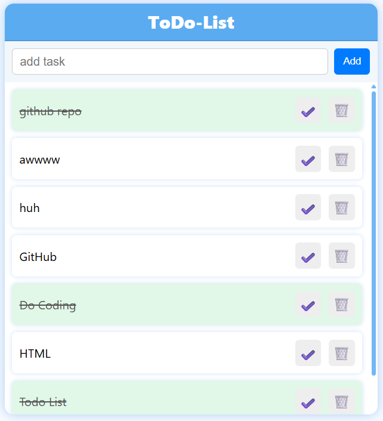

# 📝 ToDo List – Go & Vanilla JS

This is a simple ToDo List web application built using **Go (Golang)** for the backend and **Vanilla JavaScript** for the frontend.

> 📌 Made for learning and practicing the **basics of Go**, handling HTTP requests, and building a minimal full-stack app without using frameworks.

## 🚀 Features
- Add new tasks
- Mark tasks as complete
- Delete tasks
- Tasks update dynamically
- Clean UI with custom CSS and box shadows

## 📸 Screenshot

## 🛠️ Tech Used
- Backend: Go
- Frontend: HTML, CSS, JavaScript (Vanilla JS)

---

⚙️ This was a practice project for understanding server-client communication, `http.HandleFunc`, handling request bodies in Go.
